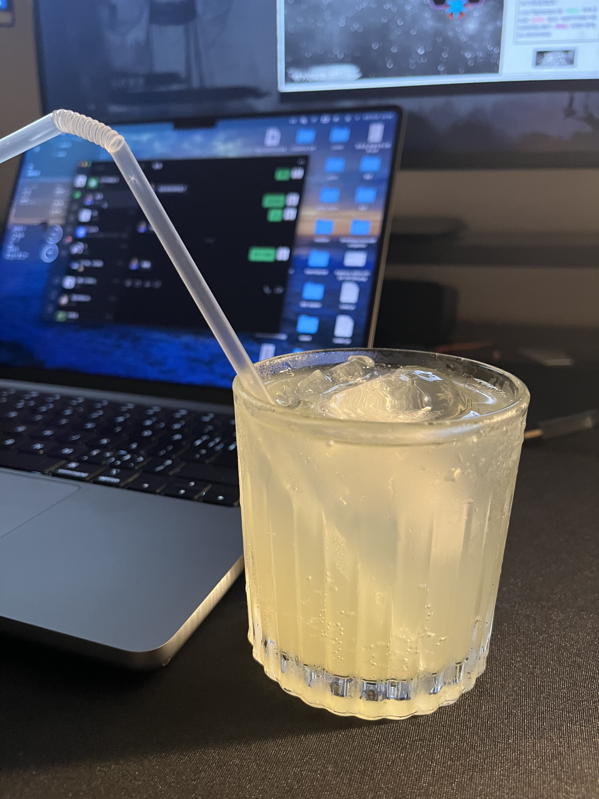

# 想谈恋爱

自创的简单鸡尾酒，主打简单快速清爽。

## 必备原料和工具

原料

- 冰块，可外卖搜索冰块，或在家中用冰盒制作
- 伏特加，推荐山姆 MM 进口美式伏特加 1.75L
- 青柠汁，推荐山姆 MM 小青柠汁饮料
- 柠檬片，可选

工具

- 调酒量杯
- 调酒棒
- 威士忌杯，推荐宜家 FRASERA 弗雷塞拉

## 计算

- 伏特加 45 毫升
- 冰块的分量能装满杯子

## 操作

1. 拿出提前冰好的杯子（冰杯可选）
2. 将冰块放入杯中，装满杯子
3. 倒入 45 毫升伏特加
4. 用青柠汁补满
5. 用调酒棒轻轻搅拌均匀

## 装饰

- 在杯口放置一片柠檬片（可选）

### 成品

如果您遵循本指南的制作流程而发现有问题或可以改进的流程，请提出 Issue 或 Pull request 。
