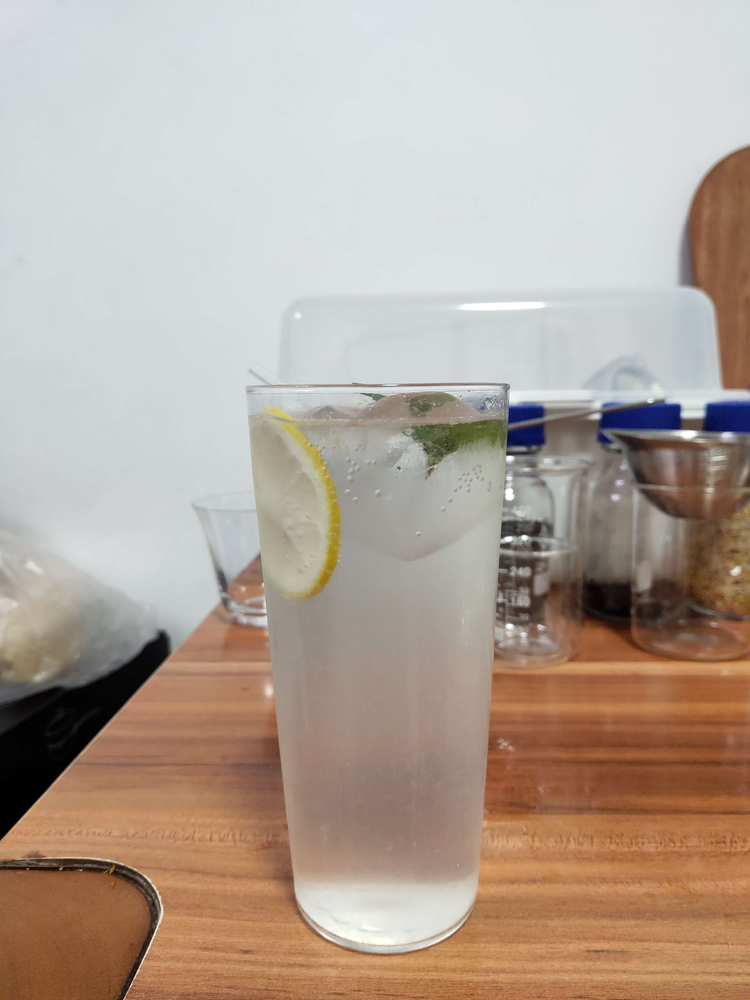

<!-- 这是 HowToDrink 菜谱仓库中的示例菜谱模板文件。 -->
<!-- 注意：在编写时，中文与英文或数字之间必须有且仅有一个空格。 -->
<!-- 注意：在编写时，标题与正文之间必须有且仅有一个空行。 -->

# 示例菜的做法

<!-- 标题必须是 `菜名` + `的做法`。和文件名一致。 -->

<!-- 如果有图片更好。 -->

<!-- 在这里简单介绍饮品的特点、是否含酒精、酒精度数（如果含酒精的话）、难度。 -->
示例是一款经典鸡尾酒——金汤力，制作简单，清爽可口，夏日必备~

<!--
1星：没有特别困难的步骤。只需要将原材料简单混合即可。大约2分钟即可完成。即使没有经验的人，也可以按照步骤做出像模像样的效果。
2星：包含的步骤非常简单。不太需要经验，只需要按照步骤进行操作即可。大约5分钟即可完成。即使没有经验的人，也可以按照步骤做出像模像样的效果，但是想要做出完美的效果就需要一定的练习。
3星：包含的步骤不算太复杂。需要一定经验。大约8分钟即可完成。对于有经验的人，并不会太难，但是想要做出完美的效果也需要一定的经验加上练习。
4星：包含了很多复杂的步骤。10分钟以内即可完成。即使是有经验的人，也需要花费很多时间来准备这道菜，但是做熟练之后，就可以做出非常美味的效果。
5星：包含了很多复杂的步骤。可能需要10分钟以上才能完成。即使是有经验的厨师，也需要花费很多时间来准备这款饮品，并且非常容易出现失误。
-->

预估烹饪难度：★★

## 必备原料和工具

<!-- 在这里列出必需原料。以方便大家快速判断自己手边的材料是否足够。-->

<!-- 注意：某些原料已经在厨房采购部分提及。这里不要重复提及： -->
<!-- 燃气灶, 饮用水, 锅, 食用油, 碗与盘子, 筷子, 炒勺, 洗涤剂, 抹布, 钢丝球, 菜刀 -->

<!-- 可以推荐购买哪个品牌的来方便决策。 -->

原料

- 金酒
- 汤力水气泡水
- 柠檬
- 冰块
- 新鲜绿叶（可选，装饰用）

工具

- 手动压汁器

## 计算

<!-- 这一章节里介绍一些计算公式，求得原料的量、重要的时间参数、混合比例，以便在后续操作中引用。 -->

<!-- 这里有两种情况： -->
<!-- 1. 可能会大批量的制作饮品。例如：聚会用可乐桶。这种情况需要给出计算公式。 -->
<!-- 2. 固定分量的饮品。每份的容量一致而永远不会发生变化。这种情况需要给出一份的量。 -->

<!-- 对于大小不一的食材，必须给出质量参考 -->
<!-- 对于可以自行斟酌加量的食材，必须给出建议添加的范围 -->
<!-- 请不要使用有大有小的容器作为单位！这会令人困惑，难以后续精准化。请使用毫升！ -->

一杯分量，约 350 毫升（含冰）

- 金酒 30~40 毫升
- 汤力水气泡水 1 罐（屈臣氏330ml）
- 柠檬 1 个
- 冰块 100 克

## 操作

<!-- 在这里详细描述饮品制作的全部流程。 -->
<!-- 不允许使用不精准描述的词汇，例如：`适 量`、`少 量`、`中 量`、`适 当`。 -->
<!-- 在这里，如果操作的食材不是“全部食材”而是“部分食材”，也必须指明。否则默认指定的是全部原料。 -->

柠檬的处理

1. 将柠檬对半切（**刀方向垂直于柠檬的头尾连线**），并从其中的一半中切取一片柠檬备用
2. 再次将柠檬对半切，将得到的 4 角柠檬用压汁器压出柠檬汁置于容器中备用

正式调配

1. 选择一个杯子，建议使用容量在 350~400 毫升的透明玻璃杯
2. 将 100 克冰块放置在杯底
3. 倒入 30~40 毫升金酒
4. 倒入 15 毫升柠檬汁（如果喜酸可以加多点或全加）
5. 用勺子搅拌均匀
6. 将之前准备的一片柠檬放置好
7. 缓慢沿杯壁注入汤力水直至满杯（不要倒在冰上，避免起泡流失）
8. 用勺子轻轻上下提拉将液体搅拌均匀（不要旋转搅拌，避免起泡流失）
9. 在液面放置好装饰用的绿叶（可选）

## 附加内容

<!-- 这里展示成品的图片 -->

### 成品

<!-- 在这里额外补充一些注意事项、参考资料、安全须知等。 -->

- 参考资料：[维基百科](https://en.wikipedia.org/wiki/Gin_and_tonic)

<!-- 必须保留下面的文字。 -->
如果您遵循本指南的制作流程而发现有问题或可以改进的流程，请提出 Issue 或 Pull request 。

<!-- 在提交 Pull Request 前，请删除模板中的所有注释。 -->
